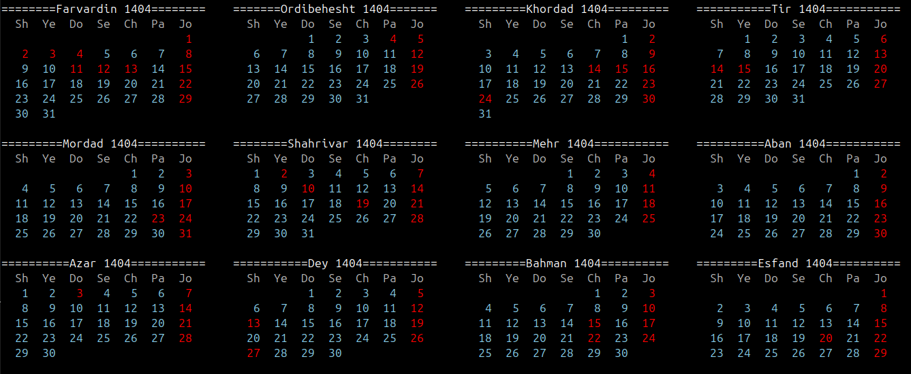
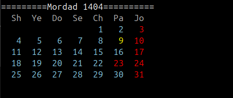
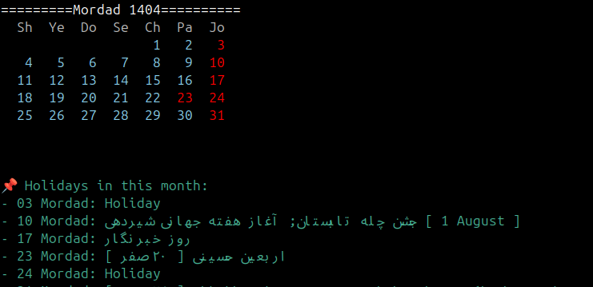

_Shamsy Calemdar CLI_

---
## Description
Shamsi Calendar CLI is a command-line tool written in Go that displays the Persian (Shamsi) calendar with support for holidays and date conversions between Gregorian and Shamsi calendars. It fetches holiday data from an external API, caches it locally, and presents the calendar in a visually appealing, color-coded format. This tool is designed for users who need to view or manage dates in the Persian calendar system, such as developers, researchers, or individuals in Iran and other Persian-speaking regions.
Features

Display a single month or a full year in the Shamsi calendar.
Highlight holidays and Fridays (traditional rest days) with color-coded output.
Convert dates between Gregorian and Shamsi calendars.
Fetch and cache holiday data for a specified year from an external API.
Support for highlighting the current day when viewing the current month.
Option to list holidays for a specific month with the --show-holidays flag.
Progress bar for API requests to enhance user experience.
ANSI-colored output for better readability in terminals.

---

## Configuration

scal does not require any configuration or environment variables by default.

- **Locale:** Output is always in English-transliterated Persian.
- **No config files** are needed.

---

## API Endpoints

This project is a CLI tool and does **not** expose any HTTP API endpoints.

---

## Contributing

We welcome contributions! To contribute:

1. Fork the repository and clone your fork.
2. Create a new branch for your feature or bugfix.
3. Write clear, idiomatic Go code. Use `gofmt` for formatting.
4. Add comments and documentation for new functions.
5. Submit a pull request with a clear description.

**Code Style:**
- Use `gofmt` before committing.
- Prefer descriptive variable and function names.
- Keep functions small and focused.

---

## Usage
The CLI supports multiple modes of operation depending on the arguments provided:

View Current Month:Display the current month with the current day highlighted:
  ```sh
  scal     
  ```
View Full Year:Display all 12 months of a specified Shamsi year (e.g., 1404):
  ```sh
  scal 1404  
  ```


View Specific Month:Display a specific month of a year (e.g., Farvardin 1404):
  ```sh
  scal 1404 1  
  ```

View Month with Holidays:Display a month and list its holidays:
  ```sh
  scal 1404 1 --show-holidays
  ```

Example Output:
 ==========Farvardin 1404============
   Sh   Ye   Do   Se   Ch   Pa   Jo
    1    2    3    4    5    6    7
    8    9   10   11   12   13   14
   15   16   17   18   19   20   21
   22   23   24   25   26   27   28
   29   30   31


📌 Holidays in this month:
- 01 Farvardin: Nowruz
...
..
.

---

## Future Improvements

Add unit and integration tests for core functions.
Support exporting calendars to formats like PDF.
Provide a configuration file for customizing colors and API endpoints.
Add custom events to Scal
Ability to convert Shamsi (Persian) dates to Gregorian dates and vice versa.


---

## Troubleshooting & FAQ

### The calendar output is misaligned!
- Make sure you are using a monospaced font in your terminal.

### I get "Invalid year or month argument."
- Ensure you provide valid numbers: `scal 1404 7`

### How do I see a different month?
- Use: `scal YEAR MONTH` (e.g., `scal 1404 12`)

### Can I use scal on Windows?
- Yes! Just build with Go and run `scal.exe`.

---

## License

This project is licensed under the [MIT License](LICENSE).

---

## Screenshots




---

## Credits & Acknowledgments

- Shamsy/Gregorian conversion algorithms inspired by open-source implementations and Wikipedia.
- Thanks to the Go community for a robust standard library.
- Special thanks to all contributors and users.

---

## Contributors

- aria(amir) ghojavand
- https://github.com/Amir-Ghojavand)
- ariaghojavand@gmail.com 


---

> _scal: Bringing the Persian calendar to your terminal, with speed and style!_


